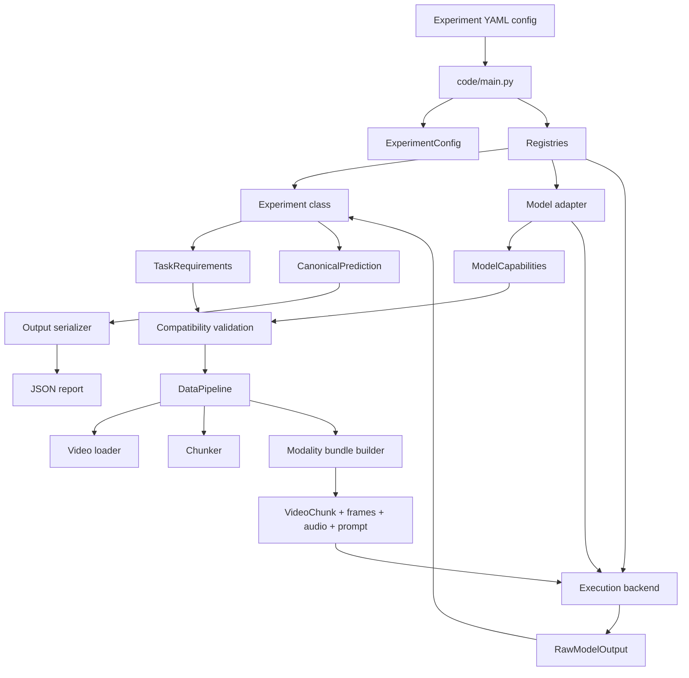

# UDIVA Experiment Framework

This repository is a modular experiment framework for video understanding tasks.
It is built to let you combine:

- a task or experiment definition
- a model adapter
- a data pipeline
- an execution backend
- an output serializer

The design goal is to decouple tasks from models so the same dataset, chunking strategy, and output format can be reused across multiple model backends.

## Repo Structure

```text
experiment-udiva/
├── README.md
├── AGENTS.md
├── ADDING_MODELS.md
├── pyproject.toml
├── uv.lock
└── code/
	├── main.py
	├── configs/
	│   ├── experiments/
	│   │   ├── chunk_classification.yaml
	│   │   ├── vqa.yaml
	│   │   └── vqa_qwen.yaml
	│   └── prompts/
	│       └── vqa_prompt.py
	├── src/
	│   ├── core/
	│   ├── data/
	│   ├── execution/
	│   ├── experiments/
	│   ├── models/
	│   └── output/
	├── tests/
	└── refrence-data-layer/
```

## Top-Level Files

- `README.md`: high-level repo guide and architecture overview.
- `AGENTS.md`: project intent, workflow conventions, and development notes.
- `ADDING_MODELS.md`: guide for adding new model adapters.
- `pyproject.toml`: dependencies, Python version, and pytest configuration.
- `uv.lock`: locked dependency versions.

## Main Runtime Flow

The execution entrypoint is `code/main.py`.

At runtime, the system does this:

1. Load a YAML experiment config.
2. Convert it into `ExperimentConfig`.
3. Resolve the experiment, model adapter, and backend from registries.
4. Validate that the model can satisfy the experiment requirements.
5. Load the model.
6. Load the video and split it into chunks.
7. Build the right modalities for each chunk.
8. Run inference through the backend.
9. Postprocess results into canonical predictions.
10. Save a task-specific JSON report.

## Architecture Diagram



## What Each Directory Does

### `code/configs`

Declarative run configuration.

- `configs/experiments/`: runnable YAML definitions.
- `configs/prompts/`: prompt builder Python files used by prompt-driven experiments like VQA.

Typical usage:

```bash
python code/main.py --config code/configs/experiments/chunk_classification.yaml
python code/main.py --config code/configs/experiments/vqa.yaml
python code/main.py --config code/configs/experiments/chunk_classification.yaml --mock
```

### `code/src/core`

Framework contracts and dependency wiring.

- `interfaces.py`: abstract interfaces for model adapters, experiments, backends, and data pipelines.
- `registry.py`: decorator-based registries for pluggable components.
- `schemas.py`: shared dataclasses passed between layers.
- `capabilities.py`: model capability and task requirement matching.

This is the package that makes the repo modular.

### `code/src/data`

Video preprocessing and modality extraction.

- `video_reader.py`: ffprobe and ffmpeg wrappers for metadata, frame extraction, and audio extraction.
- `chunker.py`: splits a video into sequential chunks.
- `pipeline.py`: capability-aware builder that extracts only the modalities required by the selected model.

This layer converts raw video into `ModalityBundle` objects.

### `code/src/experiments`

Task logic.

- `chunk_classification.py`: asks the model to assign one label per chunk.
- `vqa.py`: asks a question per chunk and optionally parses structured JSON answers.

An experiment owns:

- the task requirements
- how requests are built
- how raw outputs are postprocessed
- the overall run loop for that task

### `code/src/models`

Model adapters.

- `base.py`: device detection and quantization helpers.
- `gemma_vlm.py`: Gemma vision-language model adapter.
- `qwen_omni.py`: Qwen 2.5 Omni adapter.

Each adapter must implement the shared model interface and declare its capabilities.

### `code/src/execution`

Execution strategies.

- `single_device.py`: current backend for CUDA, MPS, or CPU inference on one device.

The backend layer is where future multi-GPU or distributed execution would be added.

### `code/src/output`

Serialization and reporting.

- `classification.py`: classification report dataclasses and JSON saving.
- `vqa.py`: VQA report dataclasses and JSON saving.

This layer converts canonical predictions into task-specific output files.

### `code/tests`

Unit and integration coverage for the framework.

Representative test areas:

- registry behavior
- schemas
- chunking
- data pipeline behavior
- execution backend behavior
- experiment logic
- model adapter behavior
- output serialization
- end-to-end VQA smoke coverage

Shared fixtures live in `tests/conftest.py`, including a `MockModelAdapter` for fast local testing.

### `code/refrence-data-layer`

Reference or legacy data-loading scripts and utilities.

This directory is not the main control path for the new framework. It appears to preserve older dataset preparation scripts such as:

- data download helpers
- transcript extraction or cleanup
- metadata utilities
- a dataloader notebook

If you are working on the current registry-driven framework, the main code path is under `code/src`, not here.

## File-by-File Walkthrough Example

This example follows one concrete run:

```bash
python code/main.py --config code/configs/experiments/chunk_classification.yaml
```

### 1. `code/configs/experiments/chunk_classification.yaml`

This file declares:

- experiment type: `chunk_classification`
- labels: `talking`, `building`, `idle`
- model: `gemma_vlm`
- chunk settings: 3-second windows, 1 FPS, low-resolution frames
- backend: `single_device`
- output path for the JSON report

This is the only file you change to run the same pipeline with different videos, labels, or models.

### 2. `code/main.py`

`main.py` loads the YAML, constructs `ExperimentConfig`, and resolves classes from the global registries.

It imports these modules only to trigger decorator-based registration:

- `src.models.gemma_vlm`
- `src.models.qwen_omni`
- `src.experiments.chunk_classification`
- `src.experiments.vqa`
- `src.execution.single_device`

Then it:

- loads the selected model
- validates compatibility
- instantiates the backend
- calls `experiment.run(...)`
- converts canonical predictions into a report

### 3. `code/src/core/schemas.py`

The YAML becomes an `ExperimentConfig` object here.

This file also defines the shared data contracts used across the pipeline:

- `VideoSample`
- `VideoChunk`
- `ModalityBundle`
- `ModelRequest`
- `RawModelOutput`
- `CanonicalPrediction`

These are the payloads passed from layer to layer.

### 4. `code/src/core/registry.py`

The registry maps names from YAML to concrete classes.

For example:

- `gemma_vlm` resolves to `GemmaVLMAdapter`
- `chunk_classification` resolves to `ChunkClassificationExperiment`
- `single_device` resolves to `SingleDeviceBackend`

This is what lets the framework stay pluggable.

### 5. `code/src/core/capabilities.py`

Before any inference runs, `main.py` validates that the selected model can support the selected task.

For chunk classification, the experiment requires:

- image input
- text input
- text generation support

If a model cannot satisfy those requirements, the run fails early with a useful error.

### 6. `code/src/experiments/chunk_classification.py`

This file defines the actual task behavior.

It decides:

- what prompt to send per chunk
- how to postprocess model output into a label
- how to loop over chunks and collect predictions

For each chunk, it asks the model to choose exactly one label from the configured set.

### 7. `code/src/data/pipeline.py`

The experiment creates a `DataPipeline` and uses it to:

- load the video
- split it into chunks
- build the modality bundle for each chunk

The key design point is capability-aware extraction. If the model asks for image and text, the pipeline extracts frames and builds a prompt. If the model also asks for audio, it extracts audio too.

### 8. `code/src/data/video_reader.py`

This is where ffprobe and ffmpeg are used.

It:

- reads video metadata
- extracts frames from each chunk at the requested FPS
- optionally resizes frames
- extracts audio when needed

This is the bridge between files on disk and tensors in memory.

### 9. `code/src/data/chunker.py`

This file converts a full video duration into chunk windows.

With the current config, it creates sequential 3-second chunks with stride 3 seconds. Short tail chunks under the threshold are dropped.

### 10. `code/src/models/gemma_vlm.py`

This adapter:

- declares model capabilities
- loads the Hugging Face processor and model
- converts frame tensors into PIL images
- builds the model input message format
- runs generation
- returns `RawModelOutput`

The rest of the framework does not need to know Gemma-specific API details because they are isolated here.

### 11. `code/src/execution/single_device.py`

This backend wraps inference on the current device.

Right now it is simple, but it provides a clean extension point for future distributed or specialized execution modes.

### 12. `code/src/output/classification.py`

After predictions are returned, `main.py` converts them into `ClassificationResult` items and writes a JSON report using this file.

### 13. `code/tests/*`

If you want to verify or extend behavior safely, the test suite mirrors the same architecture.

When you change one layer, the matching test file is usually easy to find:

- chunking logic -> `tests/test_chunker.py`
- data extraction/pipeline -> `tests/test_data_pipeline.py`, `tests/test_video_reader.py`
- experiment behavior -> `tests/test_experiment.py`, `tests/test_vqa_experiment.py`
- registries and schemas -> `tests/test_registry.py`, `tests/test_schemas.py`
- model adapters -> `tests/test_model_adapter.py`, `tests/test_qwen_omni.py`

## Minimal Files Needed To Add A New Experiment

If you want to add a new experiment type, the smallest meaningful set of files is:

### Required files

1. `code/src/experiments/my_experiment.py`

Implement a new `BaseExperiment` subclass and register it with `EXPERIMENT_REGISTRY`.

This file must define:

- `requirements`
- `prepare_request(...)`
- `postprocess(...)`
- `run(...)`

2. `code/main.py`

Add an import so the experiment registers itself at startup.

Example:

```python
import src.experiments.my_experiment  # noqa: F401
```

3. `code/configs/experiments/my_experiment.yaml`

Create a runnable config that selects:

- `experiment.type: my_experiment`
- a model
- a video
- chunking parameters
- an output path

4. At least one test file, usually `code/tests/test_my_experiment.py`

This repo is being developed in a TDD style, and the existing structure expects new functionality to be covered by tests.

### Sometimes required

Add these only if your experiment needs them:

- `code/configs/prompts/my_prompt.py`: if your experiment uses dynamic prompt builders.
- `code/src/output/my_output.py`: if classification or VQA output formats are not enough.
- updates to `code/src/core/schemas.py`: only if you truly need a new shared contract.
- updates to `code/src/core/capabilities.py`: only if your task introduces a new kind of requirement.

### Smallest practical implementation plan

1. Copy the structure of `code/src/experiments/chunk_classification.py`.
2. Change the task requirements and prompt construction.
3. Reuse `DataPipeline` unless your task truly needs a new extraction flow.
4. Reuse an existing output module if the final report shape already fits.
5. Add one YAML config and one test file.
6. Register the experiment by importing it in `code/main.py`.

## Minimal Example Skeleton For A New Experiment

```python
from __future__ import annotations

from src.core.capabilities import TaskRequirements
from src.core.interfaces import BaseExperiment, BaseExecutionBackend, BaseModelAdapter
from src.core.registry import EXPERIMENT_REGISTRY
from src.core.schemas import CanonicalPrediction, ExperimentConfig, ModelRequest, RawModelOutput, VideoChunk
from src.data.pipeline import DataPipeline


@EXPERIMENT_REGISTRY.register("my_experiment")
class MyExperiment(BaseExperiment):
	@property
	def requirements(self) -> TaskRequirements:
		return TaskRequirements(
			required_modalities={"image", "text"},
			needs_generation=True,
			output_type="text",
		)

	def prepare_request(self, chunk: VideoChunk, config: ExperimentConfig) -> ModelRequest:
		return ModelRequest(
			task="my_task",
			prompt_template=f"Analyze chunk {chunk.index}.",
		)

	def postprocess(
		self,
		raw: RawModelOutput,
		chunk: VideoChunk,
		config: ExperimentConfig,
	) -> CanonicalPrediction:
		return CanonicalPrediction(
			chunk_index=chunk.index,
			chunk_start=chunk.start,
			chunk_end=chunk.end,
			raw_text=raw.text or "",
		)

	def run(
		self,
		config: ExperimentConfig,
		model: BaseModelAdapter,
		backend: BaseExecutionBackend,
	) -> list[CanonicalPrediction]:
		pipeline = DataPipeline()
		video = pipeline.load_video(config.video_path)
		chunks = pipeline.chunk(video, config.chunk_duration, config.chunk_stride)

		predictions = []
		for chunk in chunks:
			request = self.prepare_request(chunk, config)
			bundle = pipeline.build_modality_bundle(
				chunk,
				model.capabilities,
				request,
				fps=config.fps,
				resize=config.resize,
			)
			raw = backend.run_model(model, bundle, request)
			predictions.append(self.postprocess(raw, chunk, config))

		return predictions
```

## Development Notes

- Use `python -m pytest -sv code/tests` from the repo root to run tests.
- Use `--mock` with `code/main.py` when you want to exercise the pipeline without downloading a real model.
- The current framework path is `code/src`; `code/refrence-data-layer` is reference material, not the primary architecture.
